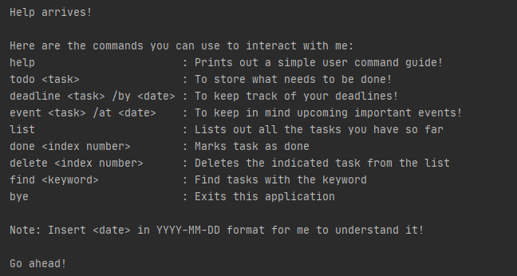
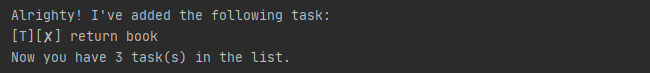
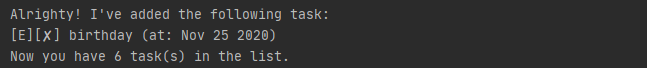
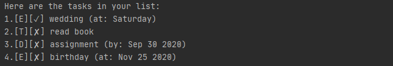
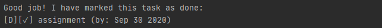
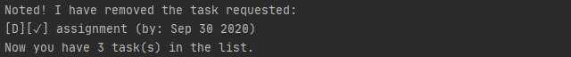
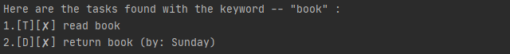

# User Guide

## What is Duke?
**Duke** is an **interactive task manager** that helps you **note down tasks** of different types
and stores them comprehensively. It also provides several functions that allows you
to **manage your stored tasks**, which allows you to focus on your work and be more
productive.

## About this User Guide
This document will show you the basic features of Duke and how to execute them.

Note the following formatting used in this document:

`help` - Words with grey highlight are commands that you can type 
in command line to execute the function in the application

`<text>` - Items encapsulated with "< >" are inputs that you define

## List of Commands
The following table is a summary of all the commands available in this application.
The feature of each command will be explained in the following section.

Command      |   Function
------------ | ------------
`help` | Prints out a simple user command guide
`todo <task>` | Stores simple task
`deadline <task> /by <date>` | Stores tasks with deadline
`event <task> /at <date>` | Stores events with their date
`list` | Lists out all the tasks stored
`done <index number>` | Marks the indicated task as done
`delete <index number>` | Deletes the indicated task from the list
`find <keyword>` | Find and list down tasks with the keyword
`bye` | Exits this application

## Starting the Program

## Features

### Symbols
The following are the symbols you will commonly see in the application:
* `[T]` - Indicates that this is a _todo_ task
* `[D]` - Indicates that this is a _deadline_ task
* `[E]` - Indicates that this is an _event_ task
* `[]`

### `help` Prints command list
This command will provide the list of commands
that you can call in Duke.

Example:

`help`

Expected outcome:

### `todo` Adds a todo task
This command will add a new _todo_ task into the list and inform
user how many tasks are there in the list.

Format:

`todo <task>`

Example:

`todo return book`

Expected outcome:

### `deadline` Adds a deadline task

This command will add a new _deadline_ task into the list and inform
user how many tasks are there in the list.

Format:

`deadline <task> /by <date>`

`<date>` format can either be:
* YYYY-MM-DD
* Any text

Example:

`deadline assignment /by 2020-09-30`

Expected outcome:

### `event` Adds an event task

This command will add a new _event_ task into the list and inform
user how many tasks are there in the list.

Format:

`deadline <task> /at <date>`

`<date>` format can either be:
* YYYY-MM-DD
* Any text

Example:

`event birthday /at 2020-11-25`

Expected outcome:

### `list` List down stored tasks

This command will print out the list of tasks stored in
the application.

Example:

`list`

Expected outcome:

### `done` Marks task as done

This command will mark the indicated task in the list as done,
provided that the task exist at that index number.

Format:

`done <index number>`

Example:

`done 3`

Expected outcome:

### `delete` Delete task

This command will delete the indicated task from the list.

Format:

`delete <index number>`

Example:

`delete 3`

Expected outcome:

### `find` Find tasks

This command allows you to find the tasks in the list with 
the corresponding keyword.

Format:

`find <keyword>`

Example:

`find book`

Expected outcome:

### `bye` Exits the application

This command allows you to exit from the application

Example:

`bye`

Expected outcome:

### File storage

The list of tasks will be stored as a txt file under _tasks.txt_ at the same
location as the program location. 

This file will be loaded each time the application
starts, allowing you to pick up from where you left off.

You may open _tasks.txt_ to view the content but **try not to modify any of the
file content** as it might cause load error the next time you run the application.

Example:

1. Open the folder where you store the .jar application file

2. Find _tasks.txt_ in the same folder